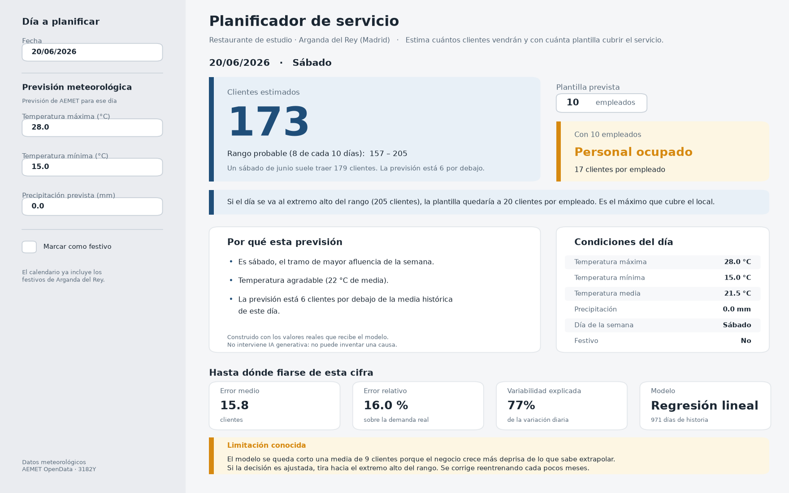

# Entrega 5 · Diseño del frontal y experiencia de usuario

**Por Juan Francisco Morales Olivo**

---

## 1. Resumen de la solución y del usuario

### El problema

En hostelería, la plantilla de cada jornada se decide casi siempre por intuición. El encargado mira el calendario, se acuerda de cómo fue el fin de semana pasado y llama a la gente. Falla en las dos direcciones y ninguna de las dos sale barata: unos días sobra personal sin actividad y otros el local se desborda.

En la Entrega 1 conté una escena concreta que resume bien el problema. Un camarero de una hamburguesería me explicó que el día anterior habían tenido un éxito enorme por el buen tiempo, y que les quedaban hamburguesas pero se habían quedado sin pan. Nadie había anticipado el día.

### El usuario

**El encargado o responsable de sala del restaurante.**

No es un perfil técnico. No sabe qué es un intervalo de confianza ni le interesa. Tiene entre uno y cinco minutos para tomar la decisión, normalmente el jueves por la tarde, y a menudo desde el móvil.

### La decisión concreta

> **¿A cuánta gente llamo para el sábado?**

Todo el frontal existe para responder a esa pregunta. Cualquier elemento de la pantalla que no ayude a contestarla sobra.

### Tipo de producto

**Predictor con recomendación operativa.**

No es un dashboard analítico. Un dashboard muestra información y deja que el usuario saque conclusiones; este producto da una estimación, la traduce en una recomendación concreta y deja que el usuario la ajuste.

### Resultado principal

El usuario introduce una fecha y la previsión meteorológica de AEMET, y obtiene:

1. **Los clientes estimados** para ese día, con su rango probable.
2. **La plantilla recomendada** para cubrirlo.
3. **Una explicación** de por qué sale ese número.
4. **La referencia histórica** de ese día, para poder comparar.

---

## 2. Mockup del frontal



*Pantalla principal. Escenario: sábado 20 de junio de 2026, 28 °C de máxima, sin lluvia.*

Una aclaración sobre esta imagen: **no está dibujada a mano**. Se genera por código (`src/visualization/generar_mockup.py`) y **las cifras que muestra son las que devuelve de verdad el modelo entrenado** para esa fecha y esas condiciones. Si el modelo se reentrena, el mockup cambia con él.

Es una decisión deliberada. Un mockup dibujado a mano puede prometer cosas que el sistema no hace. Este no puede: es una fotografía del comportamiento real.

---

## 3. Justificación del diseño

### 3.1. Utilidad y valor

#### Qué tarea resuelve

Convierte una pregunta que hoy se responde por intuición —*¿cuánta gente viene el sábado?*— en una estimación con un margen de error conocido.

#### Qué mejora

**Reduce el riesgo en las dos direcciones.** El coste de equivocarse no es simétrico y el frontal lo refleja: quedarse corto de personal daña el servicio y la reputación, mientras que pasarse solo cuesta unas horas de más. Por eso la pantalla no se limita a la predicción puntual: muestra también qué haría falta si el día se va al extremo alto del rango.

**Ahorra tiempo y discusión.** La decisión pasa de una conversación basada en recuerdos a una cifra concreta que se puede aceptar o rebatir con argumentos.

**Hace explícito el margen de error.** Ahora mismo el encargado tampoco sabe cuánta gente vendrá; lo que no tiene es una medida de cuánto puede equivocarse.

#### Qué información se muestra y cuál no

**Se muestra:**

| Elemento | Por qué |
|---|---|
| Clientes estimados | Es la respuesta a la pregunta |
| Rango probable (80 %) | Una cifra sola invita a confiar más de lo debido |
| Plantilla recomendada | Es la decisión que hay que tomar, no un dato intermedio |
| Cómo quedaría el servicio con esa plantilla | Traduce el número a una consecuencia |
| Referencia histórica del mismo día | 176 clientes solo significa algo si sabes que un sábado normal trae 179 |
| Por qué sale ese número | Sin esto el sistema es una caja negra y no se usa |
| Error medio del modelo | El usuario tiene derecho a saber cuánto puede fiarse |
| Aviso del sesgo conocido | Es la limitación más relevante y ocultarla sería deshonesto |

**No se muestra en la pantalla principal:**

| Elemento | Por qué |
|---|---|
| R², RMSE, MAPE | Solo el error medio, en clientes, es interpretable sin formación estadística |
| Coeficientes del modelo | Están en la vista de detalle, para quien quiera |
| Comparación entre los cuatro modelos | Es información del proyecto, no del usuario. Va en el desplegable |
| Gráficos de la serie histórica completa | No ayudan a decidir la plantilla del sábado |

El criterio ha sido restar. Cada elemento que añade la pantalla compite por la atención de alguien que tiene tres minutos.

#### Cómo se convierte el resultado en una acción

La cadena es explícita:

```
previsión meteorológica  →  clientes estimados  →  plantilla recomendada  →  llamar a N personas
```

El paso clave es el tercero. **El sistema no entrega un número: entrega una decisión.** Y lo hace usando los mismos umbrales de clientes por empleado con los que se etiqueta la jornada en los datos históricos:

- más de 24 clientes por empleado → faltaría personal
- entre 15 y 24 → personal ocupado
- menos de 15 → personal holgado

---

### 3.2. Flujo de usuario

#### Recorrido principal

**1. Punto de entrada.**
El usuario abre la aplicación y ve la pantalla ya resuelta para mañana, con valores meteorológicos por defecto. No hay pantalla de bienvenida ni configuración inicial: si solo quiere echar un vistazo, ya tiene una respuesta.

**2. Entradas.**
En el panel izquierdo ajusta tres cosas: la fecha, y las temperaturas y la lluvia que da AEMET para ese día. Nada más. Las variables de calendario —festivos, vacaciones, Semana Santa— las pone el sistema automáticamente, porque son las mismas con las que se entrenó el modelo.

Hay una casilla para marcar el día como festivo manualmente, por si el usuario sabe de un evento local que el calendario no recoge.

**3. Procesamiento.**
La predicción se recalcula al instante con cada cambio, sin botón de "calcular". El modelo y los datos están cacheados, así que la respuesta es inmediata y el usuario puede mover un control y ver el efecto.

Esto tiene un valor añadido: **permite explorar escenarios**. Bajar la temperatura de 28 a 18 grados y ver cómo cambia la previsión enseña más sobre el modelo que cualquier explicación.

**4. Resultado.**
Recibe la cifra grande, el rango, la plantilla recomendada y el veredicto sobre cómo quedaría el servicio.

Para saber si fiarse tiene tres apoyos: la comparación con la media histórica de ese mismo día, el error medio del modelo, y la lista de motivos que explican el número.

**5. Acción.**
Ajusta la plantilla en el control numérico. El veredicto se actualiza al momento con su decisión, no con la del sistema.

Y si el escenario alto del rango exigiría más personal, la aplicación se lo dice: *"conviene tener a alguien localizable"*.

**6. La semana completa.**
Más abajo, sin tocar ningún control, el usuario encuentra la previsión de los próximos días calculada con la predicción **real** descargada de AEMET, no con los valores que él teclea arriba.

Esto responde a cómo se decide de verdad la plantilla. Nadie planifica un sábado aislado: se mira el fin de semana entero y se reparte la gente disponible. La pantalla de arriba sirve para explorar un día y jugar con los escenarios; esta sirve para decidir.

El gráfico lleva tres cosas que el número solo no da:

- **El intervalo de cada día**, que se ensancha con la previsión. Se ve de un vistazo que el sábado es más incierto que el miércoles, y por tanto dónde conviene dejar margen.
- **La media histórica de ese día de la semana**, en naranja. Sin ella, "147 clientes" no significa nada; con ella se lee al instante si ese sábado viene cargado o flojo para lo que suele ser un sábado.
- **La plantilla recomendada**, dentro de cada barra, que es lo que el usuario ha venido a buscar.

Los días de cierre no aparecen como barras a cero, sino como una franja gris con la palabra "cerrado". Es la misma distinción que hace la capa gold al excluirlos del modelado: un día cerrado no es un día de cero clientes, es un día sin observación.

Debajo, dos frases generadas por reglas señalan el día de más carga y el que más se aparta de su media histórica, que son los dos sitios donde hay una decisión que tomar.

**6. Excepciones.**

| Situación | Qué hace la aplicación |
|---|---|
| El restaurante cierra ese día | Avisa con el motivo y no muestra predicción. No tiene sentido planificar un servicio que no existe |
| Fecha fuera del calendario generado | Calcula las variables de calendario sobre la marcha con las mismas reglas. Nunca se queda sin respuesta |
| Temperatura mínima mayor que la máxima | Error explícito en el panel, y se detiene antes de predecir |
| No existe el modelo entrenado | Mensaje claro con el comando exacto que hay que ejecutar |
| El modelo tiene un sesgo conocido | Aviso permanente en la sección de fiabilidad, con la recomendación práctica |
| No hay previsión de AEMET descargada | La semana no se dibuja; se muestra el comando exacto para descargarla. El resto de la pantalla sigue funcionando |
| La previsión descargada ha caducado | Se dibuja igualmente, con un aviso de que AEMET solo publica siete días y esos ya han pasado. Sirve para revisar el sistema, no para planificar |

---

### 3.3. Experiencia de usuario

#### Jerarquía visual

La pantalla se lee en este orden, y está construida para que así sea:

1. **La cifra de clientes**, en tipografía muy grande. Es la respuesta.
2. **La plantilla recomendada y su veredicto**, en un bloque de color a la derecha.
3. **El aviso del escenario alto**, si aplica.
4. **La explicación y las condiciones**, en dos columnas.
5. **La fiabilidad del modelo**, al final.

El tamaño y el color hacen el trabajo. La cifra principal es lo más grande de la pantalla por un factor de cinco respecto al texto normal.

#### Simplicidad

**Tres controles de entrada.** Fecha, temperaturas y lluvia. Todo lo demás lo deduce el sistema.

Esto no es una simplificación gratuita: pedir al usuario que marque si es Semana Santa o si es fin de semana sería trasladarle un trabajo que la aplicación puede hacer sola, y una fuente de errores.

**Ninguna métrica técnica en primer plano.** El R², el RMSE y la comparación de modelos existen, pero viven en un desplegable.

#### Legibilidad y consistencia

**Todo en clientes y en empleados.** Las unidades del negocio, nunca unidades abstractas.

**Código de color coherente en toda la aplicación:**

- Verde → holgado, sin problema
- Ámbar → ajustado, atención
- Rojo → riesgo de falta de personal
- Azul → información neutra

El color nunca es el único portador de información: siempre va acompañado de texto ("Personal ocupado", "Faltaría personal"), por accesibilidad.

**Lenguaje natural, no jerga.** "Rango probable (8 de cada 10 días)" en lugar de "intervalo de confianza al 80 %". Dice lo mismo y se entiende sin formación estadística.

#### Contexto y confianza

Es la parte a la que más atención he dedicado, porque **una predicción sin contexto es peor que ninguna**: invita a confiar en ella más de lo que merece.

Cuatro elementos de contexto:

1. **El rango**, siempre junto a la cifra.
2. **La comparación histórica**: *"un sábado de junio suele traer 179 clientes; la previsión está 3 por debajo"*.
3. **El error medio del modelo**, expresado en clientes.
4. **El aviso del sesgo**, con la recomendación práctica de tirar hacia el extremo alto cuando la decisión sea ajustada.

Ese cuarto punto merece un comentario. Es tentador ocultar las limitaciones de un sistema que quieres que se use. Pero un encargado que descubre por su cuenta, después de tres fines de semana cortos de personal, que la herramienta se queda corta, no vuelve a abrirla. Contarlo desde el principio, con una instrucción concreta sobre qué hacer al respecto, es lo que hace que la herramienta siga siendo útil.

#### Control del usuario

**La plantilla recomendada es una propuesta, no una orden.** El usuario la modifica y la aplicación recalcula el veredicto con su decisión, sin insistir ni volver a proponer la suya.

**La casilla de festivo manual** reconoce que el usuario sabe cosas que el sistema no.

**Los controles deslizantes** permiten explorar escenarios en lugar de aceptar un único resultado.

#### Feedback del sistema

**Respuesta inmediata.** El modelo y los datos se cachean, así que cada cambio se refleja al instante. No hay botón de "calcular" ni indicadores de carga: no hacen falta.

**Errores comprensibles y accionables.** Si falta el modelo entrenado, el mensaje incluye el comando exacto. Si las temperaturas son incoherentes, el error aparece junto al control que lo causa.

#### Accesibilidad y dispositivo

Diseño en dos columnas que Streamlit reordena en vertical en pantallas pequeñas, lo que importa porque una parte de las consultas se harán desde el móvil.

El color nunca es el único canal de información, y la cifra principal tiene contraste suficiente sobre su fondo.

---

## 4. Presentación de resultados y explicabilidad

### El resultado principal

Una **predicción numérica**: el número de clientes esperado.

### Cómo se evita presentarlo como una certeza

Cuatro mecanismos, deliberadamente redundantes:

**1. El rango va pegado a la cifra.** No en otra pestaña ni detrás de un icono de ayuda: en el mismo bloque, inmediatamente debajo.

**2. Se llama "rango probable (8 de cada 10 días)"**, no "intervalo de confianza". La formulación en frecuencias es la que la gente entiende sin formación estadística.

**3. El error del modelo está en la pantalla principal**, no escondido.

**4. El sesgo conocido se avisa explícitamente**, con la recomendación de qué hacer.

Además, el escenario alto del rango se traduce en una acción concreta: *"harían falta 2 empleados más, conviene tener a alguien localizable"*. Convertir la incertidumbre en una instrucción es más útil que mostrarla como una barra de error.

### Cómo se calcula el intervalo

Con los **percentiles empíricos de los residuos** del último año completo disponible.

No se asume que el error siga una distribución normal: se toman directamente los percentiles de los errores realmente observados. Es un método sencillo, honesto y suficiente para el MVP. Si los errores estuvieran sesgados —y lo están—, el intervalo lo refleja de forma natural.

### La explicación

Bajo la cifra aparece una lista de motivos en lenguaje natural:

> - Es sábado, el tramo de mayor afluencia de la semana.
> - Temperatura agradable (22 °C de media).
> - La previsión está en línea con la media histórica de este día.

Se construye con **reglas sobre los valores reales que ha recibido el modelo**: el día de la semana, el festivo, la lluvia prevista, los umbrales de calor y frío, y la comparación con el histórico.

### IA generativa: no se utiliza

**Este proyecto no usa IA generativa en ninguna parte de la aplicación**, y es una decisión razonada, no una limitación técnica.

La tentación era clara: un modelo de lenguaje redactaría explicaciones más fluidas y variadas que un conjunto de reglas. Pero en un sistema de apoyo a la decisión, **una explicación plausible pero falsa es peor que no dar ninguna**.

Un modelo de lenguaje al que se le da una predicción y unos datos puede escribir una justificación perfectamente creíble que atribuya el resultado a una causa que el modelo nunca usó. El encargado no tiene forma de detectarlo, y la explicación sonará mejor cuanto más se aleje de la verdad.

Con reglas explícitas eso no puede ocurrir. Cada frase corresponde a una condición comprobable sobre una variable que el modelo realmente recibió. Se pierde naturalidad y se gana trazabilidad, y en este contexto la trazabilidad vale más.

### Qué se reserva para la vista de detalle

Un desplegable "Detalle técnico del modelo" contiene el algoritmo y el periodo de entrenamiento, la comparación de los cuatro modelos, la explicación del cálculo del intervalo y el gráfico de previsión frente a realidad en 2026.

Está ahí para quien quiera auditar el sistema —incluido el tribunal—, pero cerrado por defecto para no competir con la decisión.

---

## 5. Alcance del MVP

### Implementado y funcional

- **Aplicación Streamlit completa** (`app/app.py`), con el modelo real conectado.
- **Predicción para cualquier fecha**, incluidas las que caen fuera del calendario generado.
- **Intervalo de predicción** calculado sobre residuos reales.
- **Recomendación de plantilla** con evaluación del escenario alto.
- **Explicación en lenguaje natural** basada en reglas.
- **Comparación con el histórico** del mismo día de la semana y mes.
- **Detección de días de cierre**.
- **Métricas leídas de los metadatos del modelo**, nunca escritas a mano.
- **Predicción automática a 7 días** con la previsión real de AEMET (`src/models/prediccion_manana.py`), disponible tanto desde la línea de comandos como **dentro de la propia aplicación**, con gráfico de barras, intervalo por día, referencia histórica y plantilla recomendada (`src/visualization/prevision_semana.py`).

### Solo representación visual

Nada. El mockup se genera a partir del sistema real.

### No implementado, y por qué

| Elemento | Motivo |
|---|---|
| Autenticación y multiusuario | No aporta al problema y consumiría el tiempo del MVP |
| Varios establecimientos | El modelo se entrena para un local; sería un proyecto distinto |
| Predicción por turnos | Requiere datos horarios que no existen |
| Descarga automática de la previsión desde la app | Está implementada como script; integrarla en la interfaz exigiría gestionar la API key en la sesión |
| Registro de decisiones para reentrenar | Es la línea de mejora natural, fuera del alcance del curso |

### Tecnología

| Componente | Elección | Por qué |
|---|---|---|
| Frontal | Streamlit | Permite construir un frontal funcional en Python puro, sin dedicar el tiempo del proyecto a desarrollo web |
| Modelo | scikit-learn | Estándar, y la regresión lineal se explica sin dependencias |
| Datos | CSV y Parquet-free | El volumen es de miles de filas; una base de datos sería sobreingeniería |
| Meteorología | AEMET OpenData | Fuente oficial, pública y gratuita |

### Cómo ejecutarlo

```bash
pip install -r requirements.txt
python pipeline.py
streamlit run app/app.py
```

---

## 6. Integración en el repositorio

```
docs/
├── entregas/
│   ├── 01_ideas_producto.md
│   ├── 02_datos_necesarios.md
│   ├── 03_modelo_datos.md
│   ├── 04_analisis_modelado.md
│   └── 05_diseno_frontal.md          ← este documento
└── assets/
    └── 05_mockup_frontal.png          ← generado por código

app/
└── app.py                             ← el frontal implementado

src/
├── models/prediccion.py               ← lógica compartida app / script
└── visualization/generar_mockup.py    ← genera el mockup
```

Las entregas anteriores se conservan sin modificar su contenido.

La lógica de predicción vive en **un solo sitio** (`src/models/prediccion.py`) y la usan tanto la aplicación como la predicción diaria automática. Así es imposible que den resultados distintos para las mismas condiciones.
